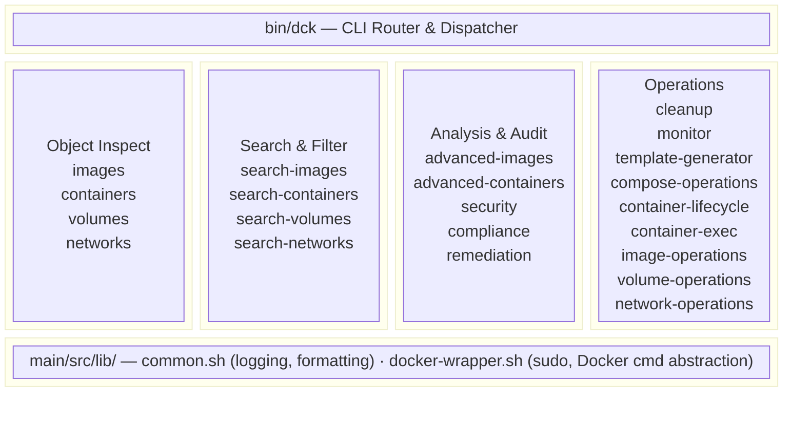
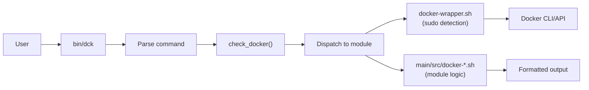

# DockerKit Architecture

**Audience**: Architects, technical leadership, contributors

## WHAT

DockerKit is a modular Bash CLI toolkit for Docker management, organized as a command dispatcher (`bin/dck`) routing to 32 specialized modules under `main/src/`.

## WHY

Docker environments need consistent security auditing, compliance checking, and resource management. A unified CLI with modular internals keeps each concern isolated while providing a single user interface.

## HOW

### System Overview

### Module Categories

| Category | Modules | Purpose |
|----------|---------|---------|
| Object Inspection | `docker-images.sh`, `docker-containers.sh`, `docker-volumes.sh`, `docker-networks.sh` | Basic Docker object listing and inspection |
| Advanced Analysis | `docker-advanced-*.sh` (4 modules) | Deep analysis with layer details, resource usage |
| Search & Filter | `docker-search-*.sh` (4 modules) | Filter objects by name, status, labels |
| Security & Compliance | `docker-security.sh`, `docker-compliance.sh`, `docker-remediation.sh` | CIS/OWASP auditing, auto-fix |
| Operations | `docker-cleanup.sh`, `docker-monitor.sh`, `docker-template-generator.sh` | Resource management, monitoring, scaffolding |
| Lifecycle | `docker-container-lifecycle.sh`, `docker-container-exec.sh`, `docker-compose-operations.sh` | Container and Compose lifecycle management |
| Object Operations | `docker-image-operations.sh`, `docker-volume-operations.sh`, `docker-network-operations.sh` | Advanced CRUD for Docker objects |

### Key Design Decisions

| Decision | Rationale |
|----------|-----------|
| Pure Bash | Zero runtime dependencies beyond Docker and standard Unix tools |
| Dispatch pattern | `bin/dck` routes to `main/src/docker-*.sh` — modules are independently testable |
| Shared libraries | `lib/common.sh` and `lib/docker-wrapper.sh` prevent duplication |
| Mock-based tests | Tests run without Docker daemon via `tests/mocks/` |
| Safety boundary | Build/test/install scripts scoped to `dck*` prefix; management CLI has full access |

### Data Flow

### Technology Stack

| Component | Technology | Version |
|-----------|-----------|---------|
| Language | Bash | 5.x |
| Base Image | Alpine Linux | 3.19.1 |
| JSON Processing | jq | Latest |
| Linting | ShellCheck, Hadolint | Latest |
| Scanning | Trivy, Docker Scout | Latest |
| Distribution | npm, Docker | Latest |

## Related Documentation

- [Safety Boundaries](../safety_boundaries.md) — Safety guarantees and scope
- [Compliance](compliance_overview.md) — CIS/OWASP compliance checking
- [Standards](../standards/README.md) — Security and coding standards
- [Compliance Checklist](compliance/compliance_checklist.md) — Architecture compliance audit
- [Developer Guide](../4-development/developer_guide.md) — Development workflow
